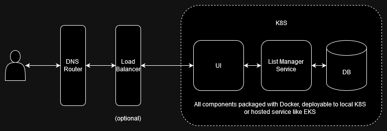

# List Manager

## Purpose
**This project is a work in progress.**

This is a pet project with (hopefully) real-life applications. It's primarily imagined as a way to create and share
grocery lists and similar shopping lists. It is intended to be hosted locally or however you prefer, but with the goal
that it provide a free (or extremely) cheap, accessible, and ad-free list management platform that is accessible to 
non-technical users.

## Architecture

## Contribution
Feel free to fork this project and modify as desired (while respecting the established licensing).
Any contributions to main line of the project should be made via pull request.

## License
Open source software licensed under the [MIT License](https://opensource.org/license/mit).